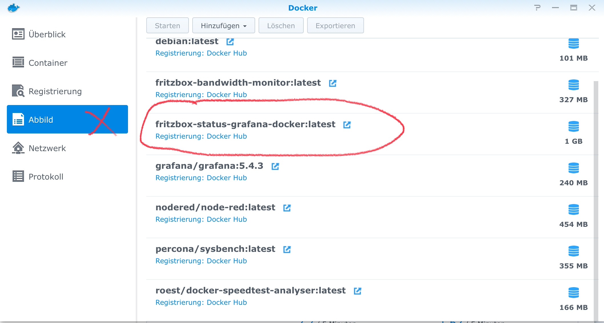
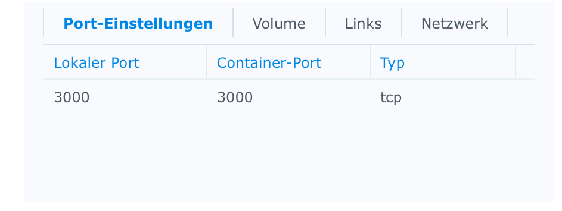
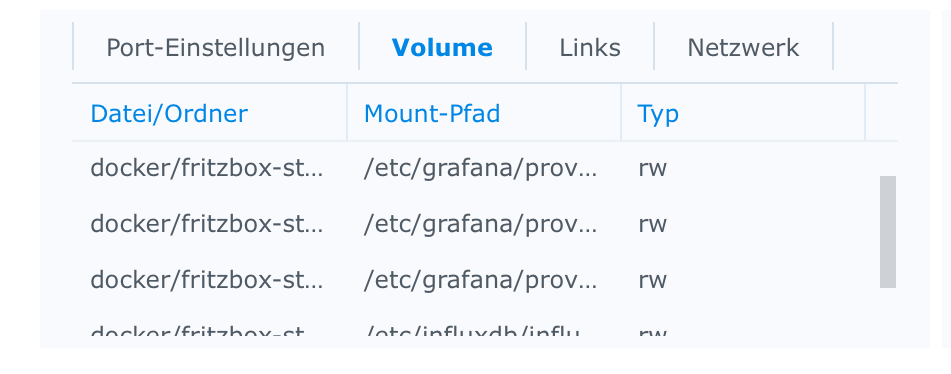

# Anmerkung
Auf der Basis von https://github.com/pkdevel/fritzbox-status-grafana-docker habe ich das Docker file mal so angepasst, dass es läuft mit dem Stand von der Anleitung. Grafana hat in der Zwischenzeit von Ubuntu/Debian auf Alpine umgestellt und in der aktuellen Ubuntu 20.04 ging das Installieren von pip nicht.
Da die Anleitung auf einer Version von 2019 basierte, habe ich es auf Basis der Version v5.4.3 angepasst und die influxdb installation repariert.
Unterschiede zu dem orginal Projekt sind also nur im Docker File.

# Anleitung für Synology (Intel basiert)

nas ist immer durch euren Hostnamen oder dessen IP zu ersetzten.

## Auf der Synology anmelden. (nehme mal an, dass das nur auf linux-basierten Synos mit dem Image möglich ist)
```
ssh admin@nas
```

## Arbeitsordner anlegen und hinein wechseln
```
mkdir docker
cd docker
```

## Baugrundlage runterladen
```
git clone https://github.com/AleksCee/fritzbox-status-grafana-docker.git
```

## Image erstellen (dauert ein wenig)
```
sudo docker build -t fritzbox-status-grafana-docker fritzbox-status-grafana-docker
```

## Externe (also Container externe) config anlegen und bearbeiten
Auf meiner Syno ist der Ordner unter /volume1/docker da habe ich dann einen Unterordner angelegt und alles aus conf hinkopiert:
```
/volume1/docker/fritzbox-status-grafana-docker/collectd.conf
/volume1/docker/fritzbox-status-grafana-docker/grafana-dashboard-fb-status.json
/volume1/docker/fritzbox-status-grafana-docker/grafana-dashboard-fb-status.yaml
/volume1/docker/fritzbox-status-grafana-docker/grafana-datasource-influxdb.yaml
/volume1/docker/fritzbox-status-grafana-docker/influxdb.conf
```

Und die Datei collectd.conf an die Daten meiner fritzbox angepasst. Dazu wie bei der verlinkten Orginal-Anleitung einen extra User in der Box anlegen.

## Dann gehts weiter in der Docker-Oberfläche von der Syno
Da sollte es jetzt unter Abbild das Image fritzbox-status-grafana-docker geben:



Das dann starten, um einen neuen Container damit zu erstellen. Hier unter erweitert bei Ports 3000 auf 3000 mappen und unter Volumes jede der kopierten Dateien mappen:




* Auf der Syno von: /volume1/docker/fritzbox-status-grafana-docker/collectd.conf
 im Container: /etc/collectd/collectd.conf.d/collectd.conf

* Auf der Syno von: /volume1/docker/fritzbox-status-grafana-docker/influxdb.conf
 im Container: /etc/influxdb/influxdb.conf

* Auf der Syno von: /volume1/docker/fritzbox-status-grafana-docker/grafana-datasource-influxdb.yaml
 im Container: /etc/grafana/provisioning/datasources/grafana-datasource-influxdb.yaml

* Auf der Syno von: /volume1/docker/fritzbox-status-grafana-docker/grafana-dashboard-fb-status.yaml
 im Container: /etc/grafana/provisioning/dashboards/grafana-dashboard-fb-status.yaml

* Auf der Syno von: /volume1/docker/fritzbox-status-grafana-docker/grafana-dashboard-fb-status.json
 im Container: /etc/grafana/provisioning/dashboards/fb-status/grafana-dashboard-fb-status.json

Dann starten lassen. Beim ersten Start dauert es etwas aber nach 1-2 minten sollte man auf http://nas:3000/ gehen können.
User/Passwort ist beim ersten Mal jeweils admin und kann/sollte geändert werden.

Damit hat man eine laufende Version mit collectd, influxdb und grafana sowie dem vorkonfigurierten Dashboard "FRITZ!Box Router Status".

Details bitte aus dem Orginal-Beitrag entnehmen, aber eigentlich sollte nichts weiter zu tun sein.

---

packed this guide into a docker image:
https://blog.butenostfreesen.de/2018/10/11/Fritz-Box-Monitoring-mit-Grafana-und-Raspberry/

# config
edit 'conf/collectd.conf' and set your fritz box's hostname and credentials

# build
```
docker build . --tag fb-grafana
```

# run
```
docker run -d --name fb-grafana \
        -p 3000:3000 \
        -v $(pwd)/conf/collectd.conf:/etc/collectd/collectd.conf.d/collectd.conf \
        -v $(pwd)/conf/influxdb.conf:/etc/influxdb/influxdb.conf \
        -v $(pwd)/conf/grafana-datasource-influxdb.yaml:/etc/grafana/provisioning/datasources/grafana-datasource-influxdb.yaml \
        -v $(pwd)/conf/grafana-dashboard-fb-status.yaml:/etc/grafana/provisioning/dashboards/grafana-dashboard-fb-status.yaml \
        -v $(pwd)/conf/grafana-dashboard-fb-status.json:/etc/grafana/provisioning/dashboards/fb-status/grafana-dashboard-fb-status.json \
        fb-grafana
```
